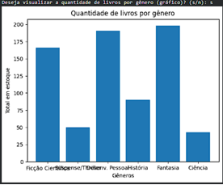

# Gestão de Biblioteca com Python & Analytics 📚📊

Sistema de gestão de acervo desenvolvido para a disciplina de **Linguagem de Programação** (Ciência de Dados - Anhanguera). 

Este projeto une **Programação Orientada a Objetos (POO)** e **Visualização de Dados** para transformar um inventário manual em uma ferramenta de suporte à decisão.

## Funcionalidades
- **Cadastro via POO:** Utiliza a classe `Livro` para padronizar registros (Título, Autor, Gênero e Qtd).
- **Busca Inteligente:** Localização de obras com tratamento de strings (`.lower()`).
- **Agregação de Estoque:** Lógica com dicionários para somar quantidades por categoria automaticamente.
- **DataViz:** Geração de gráficos de barras profissionais com `Matplotlib`.

- ### Resultado Visual

## Tecnologias
- **Python 3**
- **Matplotlib**

## Como visualizar
O projeto foi desenvolvido e testado no ambiente **Google Colab**. 

> **Nota técnica:** Os nomes no gráfico podem se sobrepor devido à resolução padrão da janela do Google Colab. Para uma visualização ideal, recomenda-se ajustar a largura da figura no código ou executar em ambiente local.

---
*Desenvolvido por Gustavo Lampert durante a graduação em Ciência de Dados.*
